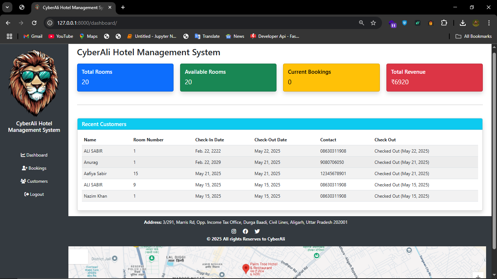
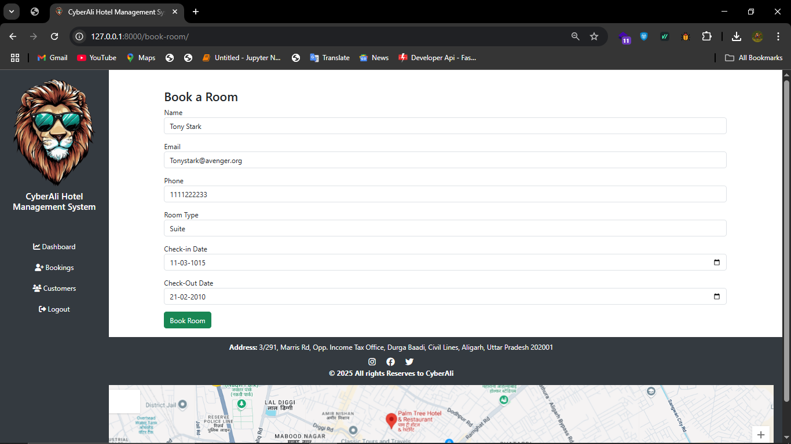
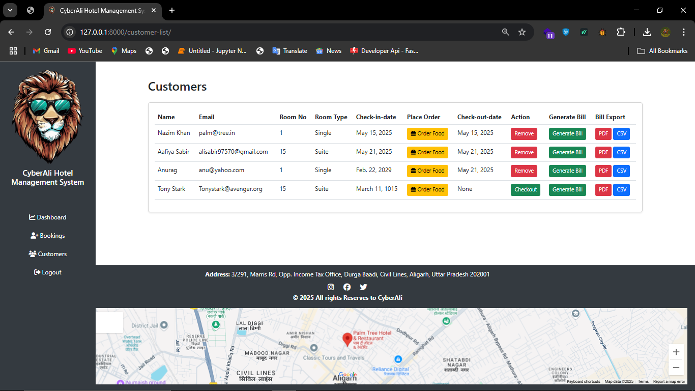
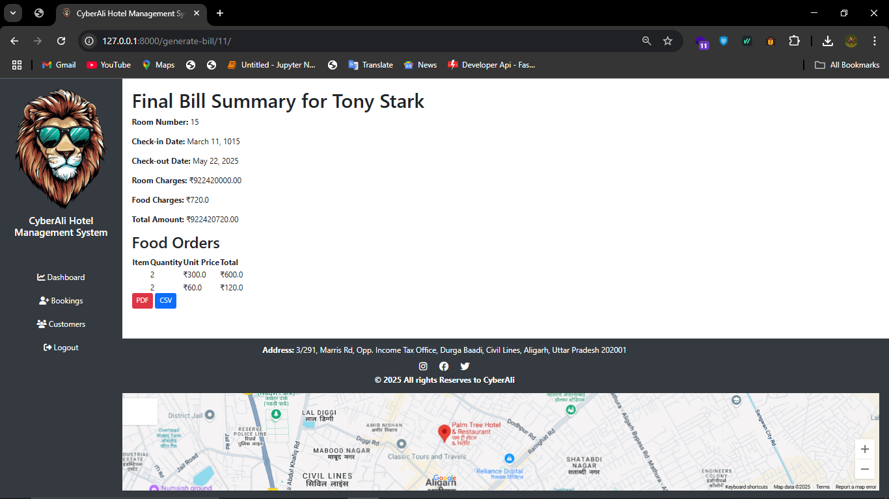
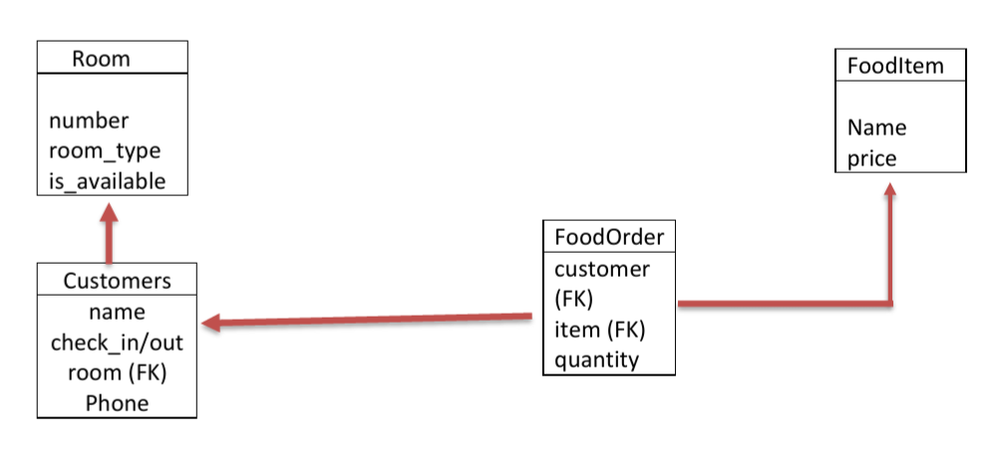
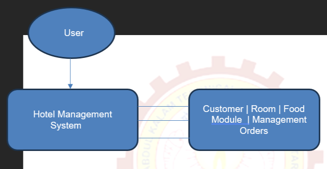
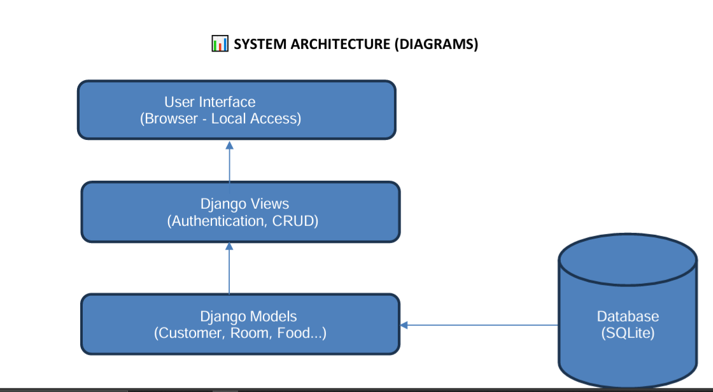

# 🏨 CyberAli Hotel Management System


> A final year B.Tech project built by Team CyberAli to automate and digitize hotel operations using Python Django, deployed as a desktop web-based app.

---

## 🔥 Features

- 🧑‍💼 Secure Admin Login
- 🛏️ Room Booking System (Check-in/Check-out)
- 🍽️ Food Menu & Order Management
- 💵 Dynamic Billing with Room & Food Charges
- 📄 PDF/CSV Export of Final Bill
- 🗃️ Real-time Room Availability Tracking
- 📊 Dashboard for Monitoring Bookings & Revenue

---

## 💻 Tech Stack

| Layer        | Tools Used                    |
|--------------|-------------------------------|
| Frontend     | HTML, CSS, Bootstrap          |
| Backend      | Python 3.10, Django Framework |
| Database     | SQLite                        |
| PDF Reports  | ReportLab                     |
| Deployment   | Localhost (Desktop App)       |

---

## 📸 Screenshots

> Add screenshots in your repo and link them here like this:
  
  
  

---

## 🧠 System Diagrams

- ✅ Entity Relation
- [ER](diagram/er.jpeg)  

- ✅ Class Diagram
-   

- ✅ Data Flow Diagram (Level 0)
-   

- ✅ System Architecture Diagram
-  

*(Available in `/diagrams` folder)*

---

## 👨‍💻 Team CyberAli

| Name                 | Course               | 
|----------------------|----------------------|
| Ali Khusroo Bin Sabir| B.Tech               |

---

## 📁 How to Run Locally

```bash
git clone https://github.com/CyberAli-eng/CyberAli-Hotel-Management-System.git
cd CyberAli-Hotel-Management-System
python manage.py migrate
python manage.py runserver
